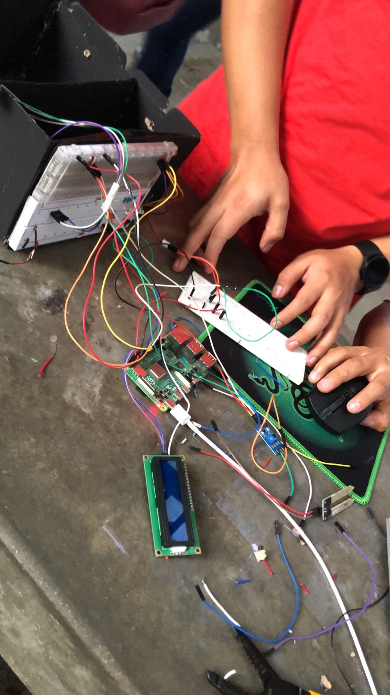

### Universidad de San Carlos de Guatemala
### Facultad de ingeniería
### Laboratorio Arquitectura de Computadores y Ensambladores 1
### Sección A
### Auxiliar: Jose Manuel López Lemus

#### PROYECTO # 1

#### Casa Inteligente
#### Manual Técnico

### Integrantes

| Nombre| Carnet |
|---|---|
| Keneth Willard López Ovalle | 202100106
| Juan José Rodas Mansilla | 202200389
| Isaac Mahanaim Loarca Bautista | 202307546
| Raúl Emanuel Yat Cancinos | 202300722

## Tópicos MQTT usados en el proyecto

## Colecciones de MongoDB
Colecciones de Mongo que se tienen planeado implementar en el proyecto

## Esquema del proyecto

## Código
#### Código que define de los endpoints de la API

#### Código que hace la conexión con MongoDB

#### Código del main.py de la Raspberry

## Fotos del equipo y proyecto

#### Foto de nuestro elemento estrella

### Y un pequeño recordatorio xd
