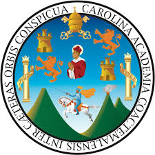

### Universidad de San Carlos de Guatemala
### Facultad de ingeniería
### Laboratorio Arquitectura de Computadores y Ensambladores 1
### Sección A
### Auxiliar: Jose Manuel López Lemus

#### PROYECTO # 1

#### Casa Inteligente
#### Manual de Usuario

### Integrantes

| Nombre| Carnet |
|---|---|
| Keneth Willard López Ovalle | 202100106
| Juan José Rodas Mansilla | 202200389
| Isaac Mahanaim Loarca Bautista | 202307546
| Raúl Emanuel Yat Cancinos | 202300722

## Explicación del proyecto
