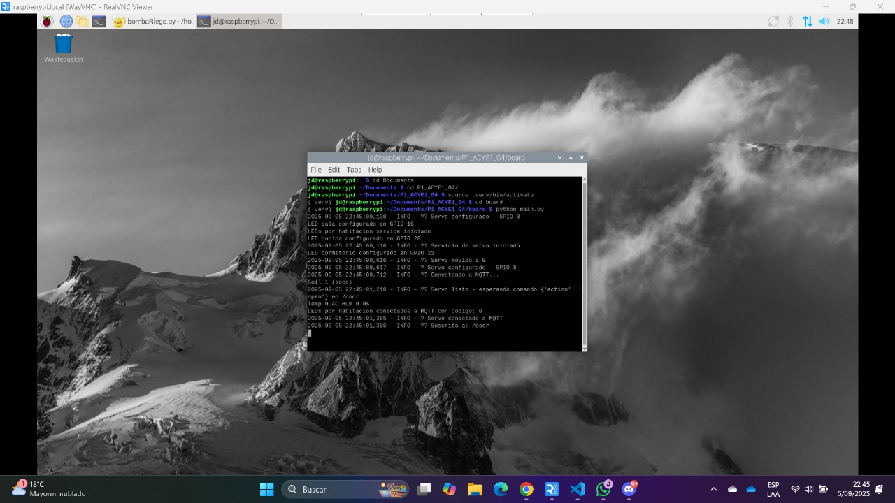
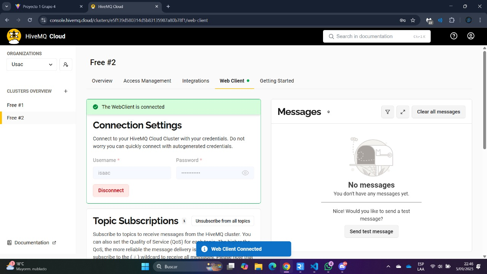
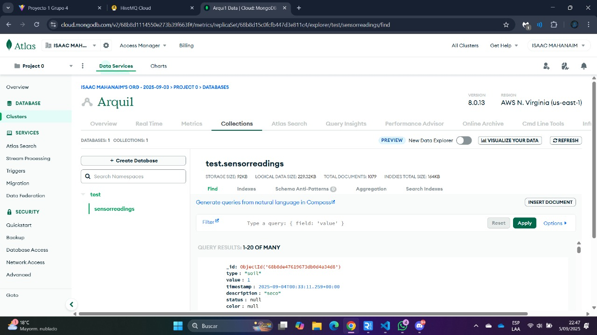
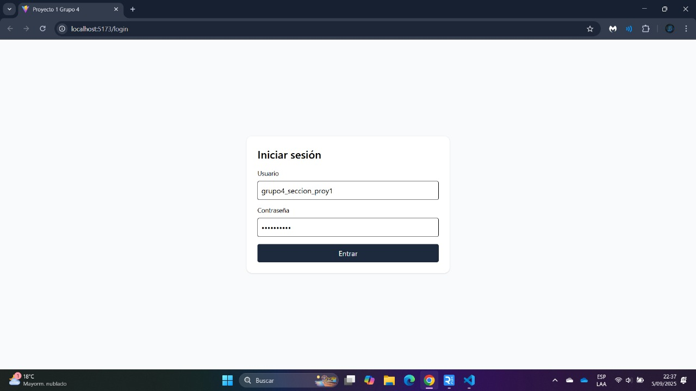
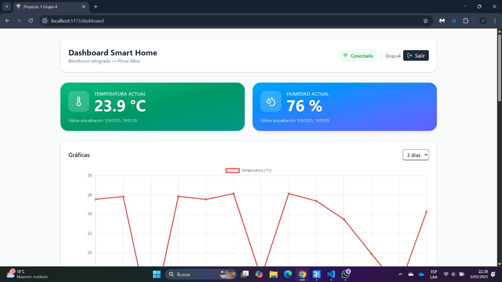
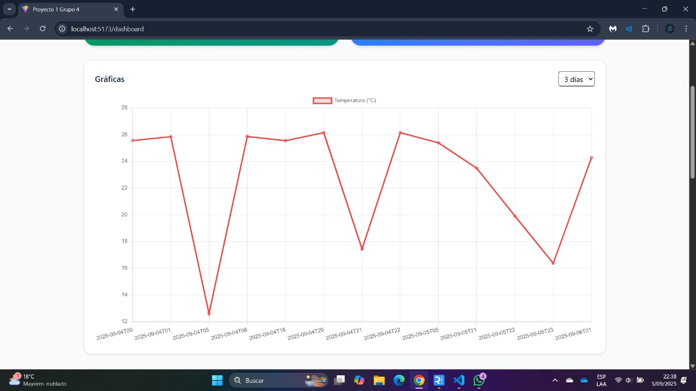
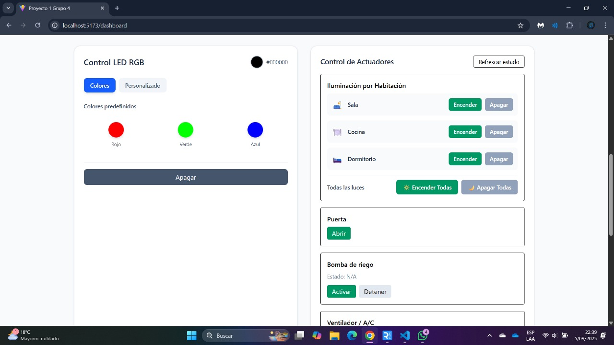
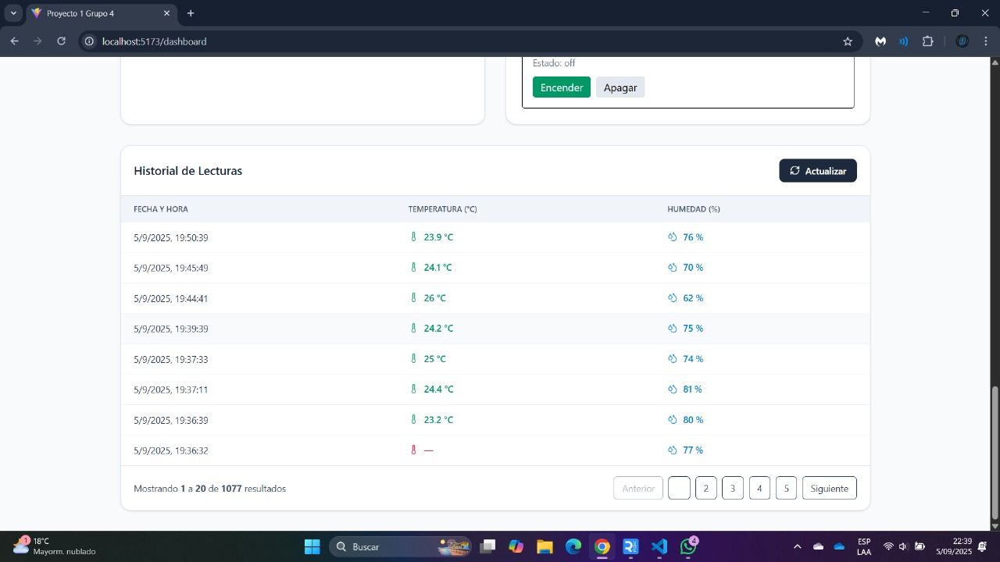

### Universidad de San Carlos de Guatemala
### Facultad de ingeniería
### Laboratorio Arquitectura de Computadores y Ensambladores 1
### Sección A
### Auxiliar: Jose Manuel López Lemus

#### PROYECTO # 1

#### Casa Inteligente
#### Manual de Usuario

### Integrantes

| Nombre| Carnet |
|---|---|
| Keneth Willard López Ovalle | 202100106
| Juan José Rodas Mansilla | 202200389
| Isaac Mahanaim Loarca Bautista | 202307546
| Raúl Emanuel Yat Cancinos | 202300722

## Explicación del proyecto
Para empezar ejecutando el programa usted debe de prender la Raspberry Pi y ejecutar su sistema operativo, luego deberá de ejecutar el programa mediante la consola de la misma.

Luego deberá de ejecutar MQTT mediante su página ya que le servirá para poder tener una comunicación eficiente y ligera en el Internet de los componentes IoT

Posteriormente deberá de ejecutar su base de datos usando MongoDB para ello debe de hacer el mismo procedimiento con MQTT pero esta vez en la página de MongoDB donde usted debe de iniciar sesión y luego cargar su base de datos.

Deberá tener lista y conectada su maqueta tanto a la raspberry como a Internet ya que sin estas dos cosas no podrá funcionar su proyecto. 

Luego debe de ejecutar el frontend donde se mostrará el inicio de sesión donde usted debe de ingresar sus credenciales para poder visualizar el Dashboard

Una vez en el Dashboard usted podrá ver las diferentes opciones que tendrá, puede ver las gráficas, los controles de temperatura y porcentaje de humedad, poder encender las LEDs, la alarma e incluso abrir el porton de la casa inteligente.

También podrá ver el registro de los datos obtenidos en días o momentos anteriores en función de los componentes IoT que la casa inteligente posee.
